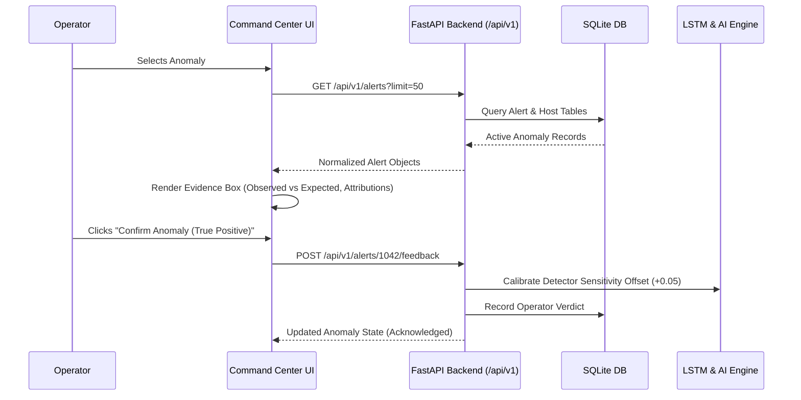

# Cloud Resource Monitoring & Intelligence Platform
## Dashboard & Frontend Architecture Document

**Version**: 3.0 Production Architecture  
**Target Audience**: SREs, DevOps Architects, Cloud Security Engineers  

---

## 1. Architectural Philosophy

The Command Center is engineered under the principle:
> **"Observe → Understand → Investigate → Act"**

It avoids generic consumer dashboard tropes (oversized cards, decorative gradients, unexplainable AI scores) in favor of a high-density, low-latency, evidence-based operational interface.

```
┌────────────────────────────────────────────────────────────────────────┐
│                   PERSISTENT APPLICATION SHELL                          │
│  [Logo] [Environment] [Global Search (Ctrl+K)] [Time Range] [Status]   │
├───────────────┬────────────────────────────────────────────────────────┤
│               │                                                        │
│  COMPACT      │                    WORKSPACE VIEWS                     │
│  SIDEBAR      │  ┌──────────────────────────────────────────────────┐  │
│  NAVIGATION   │  │ 1. Overview Command Center                       │  │
│               │  │ 2. Live Infrastructure & Host Details Modal      │  │
│  • Overview   │  │ 3. Telemetry Stream & Multi-Metric Correlation   │  │
│  • Inventory  │  │ 4. Multivariate Anomaly Center (Evidence Based)  │  │
│  • Telemetry  │  │ 5. Incidents & Chronological Timeline            │  │
│  • Anomalies  │  │ 6. Security Operations Center (SOC)              │  │
│  • Incidents  │  │ 7. Cost Intelligence & Rightsizing Proposals     │  │
│  • Security   │  │ 8. AI Incident Narrator (Cross-Module Reasoning) │  │
│  • Cost       │  │ 9. Executive & Operational Reports               │  │
│  • Narrator   │  │ 10. Append-Only Administrative Audit Trail       │  │
│  • Reports    │  │ 11. Alert Threshold Rules & Configuration        │  │
│  • Audit      │  └──────────────────────────────────────────────────┘  │
│  • Settings   │                                                        │
└───────────────┴────────────────────────────────────────────────────────┘
```

---

## 2. Component Hierarchy & State Management

### 2.1 State Store (`frontend/js/config.js`)
* **Observer Pattern**: A centralized `StateStore` broadcasts state updates (`currentView`, `currentEnvironment`, `currentTimeRange`, `notifications`) to registered listeners.
* **Isolation**: Views subscribe and unsubscribe dynamically. No memory leaks or zombie polling loops.

### 2.2 Centralized API Client (`frontend/js/api.js`)
* **Typed Requests**: Consistent promise-based requests with unified timeout limits (12 seconds) and error normalization.
* **Resilience**: Network errors and service degradation render isolated card retry buttons rather than breaking the application shell.

### 2.3 XSS Immunity & Sanitization (`frontend/js/sanitizer.js`)
* **Mandatory Escaping**: All telemetry metric names, hostnames, alert messages, and AI outputs pass through `escapeHtml()` before insertion into the DOM.
* **Masked Identifiers**: Sensitive IP addresses, credentials, and API tokens are masked with `maskSensitive()`.

---

## 3. Data Flow & Communication Lifecycle



---

## 4. Key Functional Modules

1. **Overview**: High-density operational snapshot with system health pill, active incidents counter, and host sparkbars.
2. **Infrastructure**: Filterable, searchable inventory table with instance specs, provider/region, and deep dive host modal.
3. **Telemetry Stream**: Canvas-rendered multi-metric time-series correlation charts (CPU, Memory, Disk) with threshold markers.
4. **Anomaly Center**: Deep causal investigation cards with observed values, learned normal bounds, deviation points, and true/false positive feedback loops.
5. **Incidents**: Chronological timeline of system events and degradation states.
6. **Security Center**: Network egress monitoring, authentication threat logging (SSH brute-force, port scanning), and mitigation actions.
7. **Cost Intelligence**: Cloud spend breakdown, instance rightsizing candidates, idle termination, and explicit estimated badges.
8. **AI Incident Narrator**: Grounded conversational inquiry interface citing exact metric IDs, timestamps, and alert entities.
9. **Reports & Audit**: Filterable system summaries with export capabilities and append-only administrative journals.
