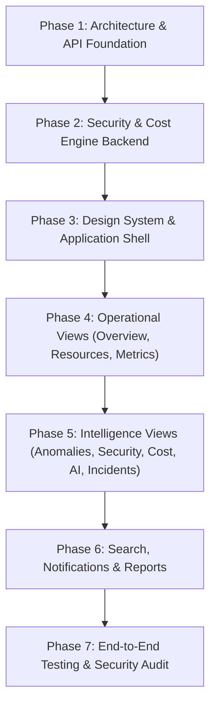

# Cloud Resource Monitoring & Intelligence Platform
## Dashboard Architecture & Engineering Audit

**Audit Date**: September 2026  
**Target Platform**: Cloud Operations + Monitoring + Security Command Center  
**System Version**: 3.0 Production Architecture  
**Auditor**: Senior Product Designer, Cloud Security Architect & SRE Lead  

---

## 1. Executive Assessment

The **Cloud Resource Monitoring & Intelligence Platform** is designed as a mission-critical operations center for DevOps, SRE, Cloud Infrastructure, and SOC teams. Prior to this redesign, the system contained an analytical deep-learning pipeline (PyTorch LSTM Autoencoder), an initial set of FastAPI telemetry ingestion endpoints, and basic database models. However, the operational presentation layer was fragmented, missing dedicated interfaces for security intrusion auditing, cost optimization intelligence, explainable anomaly evidence, and cross-module incident narration.

This audit evaluates the existing repository, outlines concrete architectural limitations, defines the design system specifications, and outlines the implementation roadmap for a unified command center.

---

## 2. Existing Architecture & Inventory

### 2.1 Backend Framework & APIs
* **Framework**: FastAPI (Python 3.13) with ASGI asynchronous request lifecycle.
* **ORM & Database**: SQLAlchemy 2.0 with SQLite (`cloud_intelligence.db`) utilizing connection pooling and memory caching.
* **Active Routers (`backend/app/api/v1`)**:
  * `/hosts`: Provisioning, metadata retrieval, status filtering, deactivation.
  * `/metrics`: Single & high-throughput batch ingestion (`MetricBatchCreate`), historical time-series queries.
  * `/alerts`: Alert listing, deduplication, operator acknowledgment (`/ack`), human feedback logging (`/feedback`), rule management.
  * `/ai`: Near-real-time multivariate scoring (`/score`), retraining jobs (`/train`), checkpoint model registry inspection (`/models`).
  * `/forecast`: Time-series forecasting with Time-to-Threshold (TTT) resource exhaustion projection.
  * `/summary`: Fleet-wide health aggregation snapshot.

### 2.2 Machine Learning & Analytical Layer
* **LSTM Autoencoder** (`models/best_lstm_anomaly_detector.pt`): PyTorch 2.x sequential model trained on 30 multi-node KPI metrics with 15-minute sliding windows.
* **Isolation Forest Detector** (`ai_engine/anomaly_detector.py`): Scikit-Learn unsupervised multivariate anomaly scoring with dynamic operator sensitivity calibration.
* **Explainability Module** (`ai_engine/explainability.py`): Residual reconstruction error decomposition calculating per-metric percentage attribution.
* **Forecaster** (`ai_engine/forecaster.py`): Trend extrapolation with exhaustion countdown heuristics.

### 2.3 Edge Monitoring Layer
* **Agent Daemon** (`monitoring_agent/agent.py`): `psutil`-based multi-threaded telemetry collector with local memory ring buffer (`buffer.py`) and disk spillover failover.

---

## 3. Identified Problems & Architectural Gaps

| Area | Current Limitation | Command Center Requirement |
| :--- | :--- | :--- |
| **User Interface** | Empty `frontend/` directory; reliance on raw API responses and CLI scripts. | Unified, high-density, dark-first operational command center supporting 11 functional modules. |
| **Anomaly Presentation** | Raw numbers and binary labels without operational context. | Evidence-based anomaly center displaying observed vs expected ranges, duration, metric deviations, and root-cause evidence. |
| **Security Telemetry** | Stub package (`security_engine/`); no dedicated security event logging or intrusion alert stream. | Signature and behavioral intrusion detection (brute-force, port scan, data exfiltration), audit logs, and masked credential viewing. |
| **Cost Intelligence** | Stub package (`cost_engine/`); no pricing catalog or idle resource analysis. | Clear spend trends, underutilized VM detection, rightsizing recommendations, and explicit "Estimated/Demo" status labeling. |
| **AI Explainability** | Generic confidence scores lacking structured causality. | Clear tripartite separation: **Observed Data** vs **Model Inference** vs **Recommended Action**. |
| **Cross-Module Narration** | Stub package (`narrator/`); no unified conversational inquiry interface. | Grounded natural-language query engine citing exact metric IDs, timestamps, and alert entities. |
| **Accessibility & UX** | Lack of standardized keyboard navigation, focus management, and ARIA attributes. | WCAG-compliant design with contrast ratios $\ge 4.5:1$, screen-reader semantics, and `Ctrl + K` global command palette. |

---

## 4. Security, Performance & Accessibility Concerns

### 4.1 Security Requirements
1. **Secret & Credential Masking**: No passwords, private keys, API secrets, or database URLs may ever be exposed to the client or rendered in the DOM.
2. **Untrusted Data & XSS Immunity**: All user inputs, log streams, metric labels, and AI-generated text must be sanitized before rendering. No arbitrary `innerHTML` injection without DOMPurify/HTML escaping.
3. **Destructive Action Safeguards**: Resource deactivation, rule deletion, and alert clearing must require explicit confirmation dialogs with impact descriptions.
4. **Audit Logging**: All operator actions (acknowledgments, rule mutations, threshold updates, manual investigations) must be persisted in an append-only audit trail.

### 4.2 Performance & Reliability
1. **Controlled Polling**: Implement structured polling intervals (15s, 30s, 60s, or manual) with immediate cancellation when views are inactive, preventing server thrashing.
2. **Client-Side Virtualization & Pagination**: Restrict table row counts and time-series sample sizes (capped at 500–1000 points) to guarantee sub-16ms render frames.
3. **Decoupled Failure Handling**: Individual API query failures must isolate to their specific component card with contextual "Retry" buttons, never crashing the parent shell.

### 4.3 Accessibility Standards
1. **Color Independence**: Severity (Critical, Warning, Info, Healthy) must be accompanied by textual badges and distinct SVGs/icons.
2. **Keyboard Navigation**: Full tab navigation, logical DOM focus trapping in modals, and keyboard accelerators (`Ctrl+K`, `Escape`).

---

## 5. Implementation Roadmap

1. **Step 1**: Expand backend API capabilities:
   * Implement `security_engine` and `/api/v1/security` endpoints.
   * Implement `cost_engine` and `/api/v1/cost` endpoints.
   * Implement `narrator` and `/api/v1/narrator` endpoints.
   * Implement `/api/v1/audit` and `/api/v1/reports` endpoints.
2. **Step 2**: Construct high-performance, dark-first web application shell in `frontend/` with zero external bloated dependencies.
3. **Step 3**: Implement interactive modules:
   * **Overview Command Center**: Fleet metrics, incident counters, compact resource health sparkbars.
   * **Live Infrastructure Grid**: Filterable, sortable host table with pagination and environment toggles.
   * **Metric Correlation Center**: Time-series charts with synchronized crosshairs, multi-metric overlay, and threshold lines.
   * **Evidence-Based Anomaly Center**: Deep investigation cards with deviation attribution, confidence intervals, and operator verdict buttons.
   * **Incident Timeline**: Chronological narrative of multi-stage degradation events.
   * **Security Operation Center**: Tamper-evident security event stream, signature detections, and authorization audit trail.
   * **Cost Intelligence**: Cloud spend breakdown, instance rightsizing candidates, and explicit estimated badges.
   * **AI Analysis & Incident Narrator**: Grounded natural-language query interface citing active metrics and alerts.
   * **Reports & Audit**: Filterable system summaries with export capabilities.
4. **Step 4**: Execute comprehensive unit, integration, and security tests across all layers.
